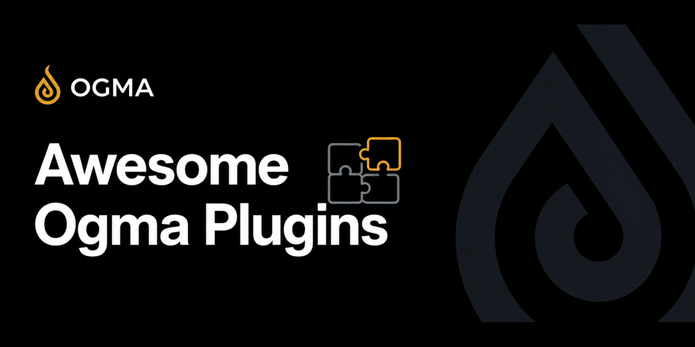

<p align="center">
  <a href="https://github.com/KaijinLab/awesome-ogma-plugins">
    
  </a>
</p>

<div align="center">

# Awesome Ogma Plugins

### A curated registry of community plugins for [Ogma](https://github.com/KaijinLab/ogma).

<br/>

[](http://creativecommons.org/publicdomain/zero/1.0/)
[](https://github.com/KaijinLab/awesome-ogma-plugins/actions/workflows/validate.yml)

<br/>

<a href="https://discord.gg/KpyamsWU3"></a>
<a href="https://x.com/kaijinlab"></a>

</div>

---

## Plugins

| Plugin | Description | Author | Tags |
|--------|-------------|--------|------|
| [Request Counter](plugins/request-counter) | Counts intercepted HTTP requests. Reference plugin for first-time contributors. | Ogma Plugins | example, reference |
| [Security Headers Checker](plugins/security-headers) | Passively checks HTML responses for missing or weak security headers. Creates a finding for each gap. | Ogma Plugins | security, passive, headers |

---

## Install a Plugin

**From the Ogma marketplace (recommended):**

1. Open Ogma and go to **Settings > Plugins > Community**.
2. Find the plugin and click **Install**.
3. Review the permissions it requests and click **Enable**.

**From a ZIP file:**

1. Download the plugin `.zip` from the `plugins/<plugin-id>/` directory in this repo.
2. In Ogma, go to **Settings > Plugins > Install**.
3. Select the `.zip` file and enable the plugin.

---

## Build a Plugin

An Ogma plugin is a directory with a `manifest.json` and one or two JavaScript files:

- **Backend** -- runs in a sandboxed JS runtime on the server. Can read HTTP history, create findings, and send requests.
- **Frontend** -- runs in a sandboxed iframe. Displays a UI panel in Ogma's sidebar.

### Minimal plugin

**manifest.json:**
```json
{
  "id": "my-plugin",
  "version": "1.0.0",
  "name": "My Plugin",
  "description": "What this plugin does.",
  "permissions": [],
  "backend": "dist/plugin.js"
}
```

**dist/plugin.js:**
```javascript
async function init(sdk) {
  sdk.console.log("My plugin started.");

  sdk.events.onInterceptRequest(async function(req) {
    sdk.console.log("Request to: " + req.getHost());
  });
}
```

Install it by pointing Ogma at the directory -- no build step required.

### TypeScript plugin

For larger plugins, TypeScript gives you type checking and better IDE support.

1. Create a plugin directory.
2. Add `package.json`, `tsconfig.json`, and `src/backend.ts`.
3. Install types: `npm install --save-dev @kaijinlab/ogma-sdk esbuild typescript`
4. Build: `npm run build` -- outputs to `dist/`.

See the [security-headers plugin](plugins/security-headers) for a complete example. See [PLUGIN_SPEC.md](PLUGIN_SPEC.md) for the full API reference.

### Constraints

- No `import` or `require` in backend plugins. All code must be bundled into a single file.
- No `fetch` or `XMLHttpRequest` in backend plugins. Use `sdk.requests.send()`.
- No `localStorage` in frontend plugins. Use `sdk.storage` for persistence.
- Max backend script size: 256 KB.

---

## Submit a Plugin

See [CONTRIBUTING.md](CONTRIBUTING.md) for the full requirements.

1. Fork this repository.
2. Create `plugins/<your-plugin-id>/` with source, compiled `dist/`, `README.md`, and `LICENSE`.
3. Build the ZIP: `zip -r <id>.zip manifest.json dist/ README.md LICENSE`
4. Compute the hash: `sha256sum <id>.zip`
5. Add an entry to `plugins.json` with the in-repo download URL and hash.
6. Open a pull request.

---

## Security Model

All plugins are hosted directly in this repository. No external download links.

When Ogma installs a plugin from this registry:

1. Ogma fetches `plugins.json` from this repository.
2. Ogma downloads the ZIP from this repository -- not from the author's server.
3. Ogma verifies the SHA-256 hash before extracting anything.
4. If the hash does not match, installation stops.

Every change requires a new pull request and a new review. Plugin authors cannot push silent updates after approval.

---

## Plugin Quality Standards

Accepted plugins must:

- Have source code in the `src/` directory
- Include compiled output in `dist/`
- Have a `README.md` explaining what the plugin does and what permissions it needs
- Have a `LICENSE` file (any OSI-approved license)
- Not call external servers unless documented and disclosed
- Not contain obfuscated code that obscures intent

---

## License

Registry metadata (README, CONTRIBUTING, plugins.json) is [CC0 1.0](LICENSE). Individual plugins retain their own licenses.
